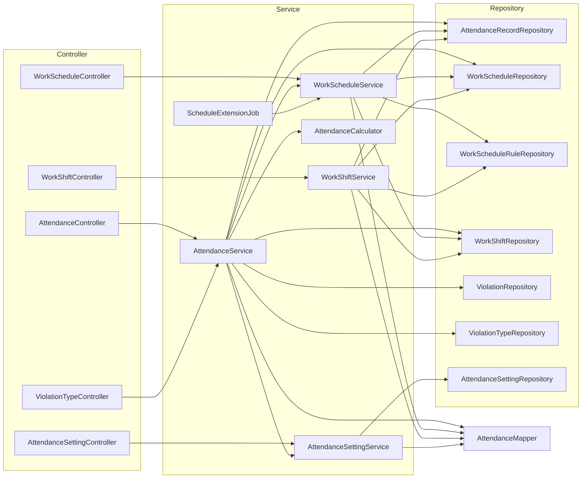
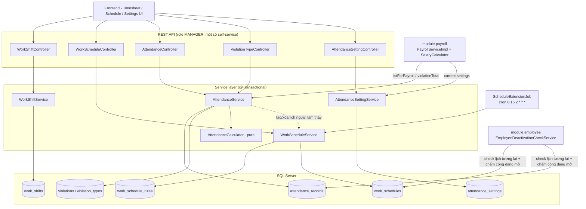
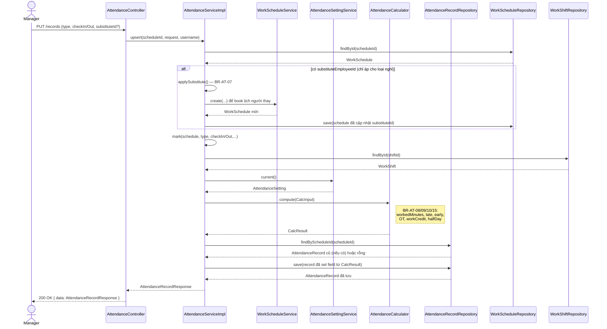
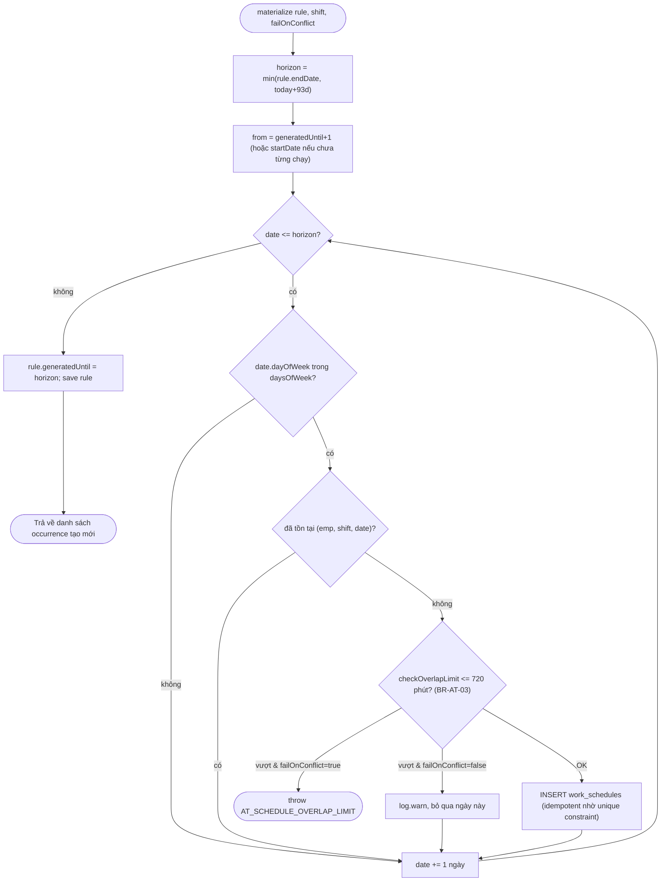

# Phân tích module Attendance (`module/attendance`)

> Phạm vi: toàn bộ `Backend/src/main/java/com/rms/restaurant/module/attendance/**`, migration `V30__create_attendance.sql` + các migration bổ sung (`V47`, `V60`, `V61`, `V62`), enum dùng chung (`AttendanceType`, `WorkShiftStatus`, `ManualTimeMode`), và các điểm tích hợp chéo module (`payroll`, `employee`, `authentication`). Đọc trực tiếp từ source code hiện tại (không suy đoán) — mọi class/hàm được nêu đều đã được mở file xác nhận.

---

## 1. Mục đích của module

Attendance (AT) là module **chấm công & xếp lịch làm việc do quản lý (MANAGER) vận hành**, thay thế nguồn dữ liệu chấm công cho Payroll (module `roster` cũ vẫn còn nhưng đã "đóng băng", không còn được payroll đọc — xem mục 8). Module giải quyết 3 nhóm bài toán:

1. **Định nghĩa & xếp lịch làm việc**: mẫu ca làm việc (`WorkShift`), lịch lặp lại theo tuần (`WorkScheduleRule`) và các occurrence cụ thể theo ngày (`WorkSchedule`) — được "vật lý hóa" (materialize) trước thay vì tính toán động phía client.
2. **Ghi nhận chấm công thực tế**: mỗi occurrence có 0..1 bản ghi chấm công (`AttendanceRecord`) — có mặt / nghỉ có phép / nghỉ không phép, kèm các chỉ số phái sinh (đi trễ, về sớm, tăng ca, công) được tính và **lưu cứng tại thời điểm chấm công**.
3. **Vi phạm & tổng hợp**: quản lý danh mục vi phạm (`ViolationType`) và các vi phạm cụ thể gắn vào bản ghi chấm công (`Violation`), rồi tổng hợp theo nhân viên/kỳ (`AttendanceSummaryRow`) để feed sang Payroll tính lương và khấu trừ.

Ngoài ra module cung cấp một luồng self-service nhỏ (chấm công vào/ra cho chính nhân viên) và một singleton cấu hình (`AttendanceSetting`) điều khiển toàn bộ công thức tính toán.

---

## 2. Kiến trúc module

Kiến trúc theo đúng pattern layered chuẩn của dự án (Controller → Service interface → Service impl → Repository → Entity), **không có sub-package `dto/request` `dto/response` riêng** (dto phẳng trong 1 package), và có thêm 2 thành phần đặc thù:

- **`AttendanceCalculator`**: một `@Component` **thuần túy (pure)**, không truy cập repository — nhận input (giờ ca, giờ thực tế, cấu hình) và trả kết quả tính toán. Đây thực chất đóng vai trò lớp "Utils/Domain logic" tách khỏi Service để unit-test độc lập (giống `SalaryCalculator` bên Payroll).
- **`ScheduleExtensionJob`**: một `@Component` chạy `@Scheduled` (cron `0 15 2 * * *`), không phải Controller/Service theo nghĩa REST — đây là background job gọi lại `WorkScheduleService.extendRollingWindow()`.

Không có package `config` riêng cho module này — việc bật `@Scheduled` phụ thuộc vào `@EnableScheduling` khai báo toàn cục ở `common/config/AsyncConfig.java` (dùng chung, không phải config riêng của AT).

```
module/attendance/
├── controller/   5 REST controller
├── service/      4 interface + AttendanceCalculator (pure) + ScheduleExtensionJob (scheduled job)
│   └── impl/     4 impl class (@Service @Transactional)
├── repository/   7 Spring Data JPA repository
├── model/        7 JPA entity
├── dto/          18 record/enum (request + response)
└── mapper/       1 mapper thủ công (AttendanceMapper, không dùng MapStruct)
```

Mô hình dữ liệu phân tầng theo đúng comment đầu file migration V30:

```
work_shifts (mẫu ca)
     └─> work_schedule_rules (quy tắc lặp tuần, BR-AT-04)
              └─> work_schedules (occurrence vật lý hóa theo ngày, 0..1 record)
                       └─> attendance_records (chấm công thực tế)
                                └─> violations (BR-AT-12, N:1 tới violation_types)
```

Điểm kiến trúc quan trọng: **schedule không được expand động phía client** — mỗi lần tạo rule lặp, server tạo ngay các occurrence cho tới `today+93 ngày` (`WINDOW_DAYS = 93`), và một job đêm (`ScheduleExtensionJob`) chạy lúc 2:15 sáng để "đẩy" watermark `generatedUntil` của các rule vô hạn (`endDate = null`) tiến thêm, giữ cửa sổ vật lý hóa luôn còn 93 ngày phía trước. Ràng buộc `UNIQUE(employee_id, shift_id, work_date)` khiến việc này idempotent — chạy lại không tạo trùng.

---

## 3. Danh sách class theo vai trò

### Controller (5)
| Class | Base path | Role yêu cầu (class-level) |
|---|---|---|
| `AttendanceController` | `/api/attendance` | `MANAGER` (một số method override xuống `WAITER,CASHIER,MANAGER`) |
| `AttendanceSettingController` | `/api/attendance/settings` | `MANAGER` |
| `ViolationTypeController` | `/api/attendance/violation-types` | `MANAGER` |
| `WorkScheduleController` | `/api/attendance/schedules` | `MANAGER` |
| `WorkShiftController` | `/api/attendance/shifts` | `MANAGER` |

### Service (interface + impl)
| Interface | Impl | Trách nhiệm |
|---|---|---|
| `AttendanceService` | `AttendanceServiceImpl` | Timesheet, chấm công thủ công/tự động/gộp ca, vi phạm, tổng hợp, feed payroll |
| `WorkScheduleService` | `WorkScheduleServiceImpl` | CRUD lịch làm việc, vật lý hóa rule, overlap check (BR-AT-03), cửa sổ cuộn (BR-AT-04) |
| `WorkShiftService` | `WorkShiftServiceImpl` | CRUD mẫu ca làm việc |
| `AttendanceSettingService` | `AttendanceSettingServiceImpl` | Đọc/ghi singleton cấu hình |

Thành phần phụ trợ (không phải interface/impl chuẩn nhưng nằm trong package `service`):
- **`AttendanceCalculator`** — pure calculator (xem mục 2), record nội bộ `CalcInput`/`CalcResult`/`MergedShiftInput`/`MergedSlot`.
- **`ScheduleExtensionJob`** — scheduled job gọi `WorkScheduleService.extendRollingWindow()`.

### Repository (7, đều là Spring Data JPA)
`AttendanceRecordRepository`, `AttendanceSettingRepository`, `ViolationRepository`, `ViolationTypeRepository`, `WorkScheduleRepository`, `WorkScheduleRuleRepository`, `WorkShiftRepository`.

### Entity (7)
`WorkShift`, `WorkScheduleRule`, `WorkSchedule`, `AttendanceRecord`, `AttendanceSetting` (singleton, `FIXED_ID`), `Violation`, `ViolationType`.

### DTO (18)
Request: `ShiftRequest`, `ScheduleCreateRequest`, `AttendanceUpsertRequest`, `BulkAttendanceRequest`, `ViolationRequest`, `ViolationTypeRequest`, `AttendanceSettingRequest`.
Response: `ShiftResponse`, `ScheduleResponse`, `AttendanceRecordResponse`, `TimesheetCellResponse`, `AttendanceSummaryRow`, `AttendanceForPayroll`, `ViolationResponse`, `ViolationTypeResponse`, `AttendanceSettingResponse`.
Enum nội bộ dto: `TimesheetStatus` (presentation-only, không lưu DB).
Enum dùng chung (`common/utils/enums`): `AttendanceType`, `WorkShiftStatus`, `ManualTimeMode`.

### Mapper (1)
`AttendanceMapper` — mapper thủ công (method thường, không dùng MapStruct/annotation processor), gom nhiều bảng tra cứu (`Map<String, Employee>`, `Map<String, WorkShift>`...) truyền vào để tránh N+1 query khi map list.

### Config
**Không có config class riêng cho module này.** `@Scheduled` của `ScheduleExtensionJob` chạy được là nhờ `@EnableScheduling` khai báo ở `common/config/AsyncConfig.java` (dùng chung toàn hệ thống, không thuộc sở hữu của module attendance).

### Utils
Không có package `utils` riêng trong module. Vai trò "utils" nghiệp vụ thuần túy do **`AttendanceCalculator`** đảm nhiệm (xem mục 2 — nó không có state, không gọi repository, unit-test độc lập tại `AttendanceCalculatorTest`).

---

## 4. Luồng xử lý theo từng use case

### UC-AT-01 — Quản lý mẫu ca làm việc (`WorkShiftController` / `WorkShiftService`)
- Tạo: kiểm tra trùng tên (`existsByNameIgnoreCase`) → lưu `WorkShift` (mặc định `status=ACTIVE`).
- Sửa: kiểm tra trùng tên loại trừ chính nó → cập nhật field, có thể đổi `status`.
- Xóa: **BR-AT-02** — nếu đã có `AttendanceRecord` tham chiếu qua schedule tới shift này (`existsForShift`) thì chặn xóa; nếu chưa, xóa luôn `work_schedules` + `work_schedule_rules` tham chiếu shift đó rồi mới xóa `WorkShift` (dọn theo thứ tự FK con → cha trong cùng transaction).

### UC-AT-02 — Xếp lịch làm việc (`WorkScheduleController` / `WorkScheduleService`)
- Tạo lịch: fan-out `employeeIds × shiftIds`. Với mỗi cặp:
  - Nếu `repeatWeekly=false`: tạo 1 occurrence (`createOccurrence`) sau khi qua kiểm tra trùng (`existsByEmployeeIdAndShiftIdAndWorkDate`) và **BR-AT-03** (tổng overlap theo cặp giữa các ca trong ngày ≤ 720 phút, đã chuẩn hóa qua đêm).
  - Nếu `repeatWeekly=true`: tạo `WorkScheduleRule` rồi gọi `materialize(..., failOnConflict=true)` để sinh ngay các occurrence từ `startDate` tới `min(endDate, today+93d)`.
- Xóa 1 occurrence: chặn nếu đã có `AttendanceRecord` (BR-AT-01 phái sinh — không xóa lịch đã chấm công).
- Hủy rule (`cancelRule`/`cancelRuleFrom`): xóa các occurrence **chưa chấm công** từ ngày cắt trở đi (`findUnattendedByRuleAfter`), cắt `endDate`/`generatedUntil` của rule về ngày trước cutoff (occurrence đã có chấm công thì giữ nguyên, không đụng tới lịch sử).
- Cửa sổ cuộn (**BR-AT-04**, job đêm 2:15AM): với mỗi rule vô hạn còn watermark thấp hơn `today+93d`, kiểm tra nhân viên còn `ACTIVE` (**BR-EMP-04** — nhân viên nghỉ việc thì không sinh thêm occurrence mới) rồi `materialize(..., failOnConflict=false)` — bỏ qua (log warn), không throw, nếu một ngày cụ thể bị conflict.

### UC-AT-03/04 — Chấm công thủ công & hàng loạt (`AttendanceController` / `AttendanceService`)
- `upsert` (1 schedule): xử lý người làm thay nếu có (**BR-AT-07**) rồi gọi `mark(...)` → tính toán qua `AttendanceCalculator.compute` → lưu/ghi đè `AttendanceRecord` (đã có thì update tại chỗ, tính lại toàn bộ chỉ số — UC-AT-03 A2).
- `bulkMark` (nhiều schedule cùng lúc): nếu `merged=false` — áp cùng type/giờ cho từng schedule độc lập; nếu `merged=true` — đi qua `markMerged` (**BR-AT-11**): validate cấu hình gộp ca đang bật, tất cả schedule cùng 1 nhân viên/1 ngày, ≥2 ca, rồi `AttendanceCalculator.splitMergedPunch` cắt 1 cặp Vào–Ra thành các slot theo từng ca (ca giữa được `autoFilled=true`).
- Self-service `checkIn`/`checkOut`: chỉ cho chấm công **lịch của chính người gọi** (`requireOwnSchedule`), chỉ cho ngày hôm nay, chặn chấm 2 lần.
- Xóa bản ghi: xóa `Violation` con trước (`deleteByAttendanceRecordId`) rồi xóa `AttendanceRecord` (tránh vi phạm FK).

### UC-AT-05 — Cấu hình chấm công (`AttendanceSettingController` / `AttendanceSettingService`)
Đọc/ghi 1 dòng singleton (`AttendanceSetting.FIXED_ID`, seed sẵn ở V30, **không bao giờ tạo mới trong code**). `update` validate toàn bộ form như một khối (**BR-AT-14** trong doc business-rules) trước khi lưu. Thay đổi ở đây **chỉ ảnh hưởng các lần chấm công sau này** — record cũ đã lưu chỉ số phái sinh, không bao giờ bị tính lại (comment rõ ở `AttendanceRecord` và `AttendanceServiceImpl`).

### UC-AT-06 — Vi phạm (`AttendanceController` cho record-level + `ViolationTypeController` cho danh mục)
- Danh mục: CRUD `ViolationType`; xóa là **soft-delete** nếu đã từng bị tham chiếu (`existsByViolationTypeId`), xóa cứng nếu chưa từng dùng.
- Vi phạm trên 1 record: `replaceViolations` xóa sạch violations cũ của record rồi insert lại toàn bộ danh sách mới (replace-all, không phải patch từng dòng) — mỗi dòng **chụp nhanh (snapshot)** `appliedPenalty` (dùng override nếu FE gửi, không thì lấy `type.getPenaltyAmount()` tại thời điểm lưu — **BR-AT-12**, sửa `ViolationType.penaltyAmount` sau này không ảnh hưởng vi phạm đã ghi).

### UC-AT-07 — Timesheet & tổng hợp
- `timesheet`/`myTimesheet`: build "cell" cho mỗi occurrence trong khoảng ngày — join thêm record, violations, employee, shift, tính `displayStatus` (enum trình bày `TimesheetStatus`, không lưu DB).
- `summary`: gom theo nhân viên trong khoảng ngày — đếm present/leave, tổng late/early/OT/công/phạt — dùng làm input CSV export và cho Payroll.

---

## 5. Chi tiết từng API

Ký hiệu transaction: tất cả method ghi đều nằm trong transaction mức class `@Transactional` của service impl (mặc định read-write); các method đọc override `@Transactional(readOnly = true)` — transaction **mở tại boundary của service method** (Spring proxy AOP), không phải ở controller.

### `AttendanceController` (`/api/attendance`)

| API | Method Controller | Service gọi | Repository truy vấn | Entity thay đổi | Transaction | Response |
|---|---|---|---|---|---|---|
| `GET /timesheet` | `timesheet` | `AttendanceService.timesheet` | `WorkScheduleRepository.findByWorkDateBetween`, `AttendanceRecordRepository.findByScheduleIdIn`, `ViolationRepository.findByAttendanceRecordIdIn`, `ViolationTypeRepository.findAllById`, `EmployeeRepository.findByIdIn`, `WorkShiftRepository.findAllById` | — (chỉ đọc) | readOnly | `List<TimesheetCellResponse>` |
| `GET /summary` | `summary` | `AttendanceService.summary` | như trên + gom nhóm Java-side (không GROUP BY SQL) | — | readOnly | `List<AttendanceSummaryRow>` |
| `GET /timesheet/me` | `myTimesheet` | `AttendanceService.myTimesheet` | `UserRepository.findByUsername`, `EmployeeRepository.findByUserId`, rồi như `timesheet` nhưng lọc theo `employeeId` | — | readOnly | `List<TimesheetCellResponse>` (chỉ lịch của bản thân) |
| `POST /schedules/{id}/check-in` | `checkIn` | `AttendanceService.checkIn` | `WorkScheduleRepository.findById`, `UserRepository`, `EmployeeRepository`, `AttendanceRecordRepository.findByScheduleId` → `mark()` → `WorkShiftRepository.findById`, `AttendanceSettingRepository` (qua `settingService.current()`) | **Insert/Update `AttendanceRecord`** | read-write | `AttendanceRecordResponse` |
| `POST /schedules/{id}/check-out` | `checkOut` | `AttendanceService.checkOut` | tương tự check-in, cộng thêm đọc `existing.getActualCheckIn()` | **Update `AttendanceRecord`** | read-write | `AttendanceRecordResponse` |
| `PUT /schedules/{id}/record` | `upsert` | `AttendanceService.upsert` | `WorkScheduleRepository`, `EmployeeRepository` (nếu có substitute), `WorkShiftRepository`, `AttendanceSettingRepository`, `AttendanceRecordRepository` | **Insert/Update `AttendanceRecord`**, có thể **Update `WorkSchedule.substituteEmployeeId`** + **Insert/Delete `WorkSchedule`** (booking/release lịch người thay) | read-write | `AttendanceRecordResponse` |
| `POST /records/bulk` | `bulkMark` | `AttendanceService.bulkMark` | như `upsert` lặp lại N lần, hoặc (nếu `merged=true`) qua `AttendanceCalculator.splitMergedPunch` trước khi ghi | **Insert/Update nhiều `AttendanceRecord`** | read-write | `List<AttendanceRecordResponse>` |
| `GET /records/{id}` | `getRecord` | `AttendanceService.getRecord` | `AttendanceRecordRepository.findById` | — | readOnly | `AttendanceRecordResponse` |
| `DELETE /records/{id}` | `deleteRecord` | `AttendanceService.deleteRecord` | `AttendanceRecordRepository.findById`, `ViolationRepository.deleteByAttendanceRecordId`, `AttendanceRecordRepository.delete` | **Delete `Violation`(s)**, **Delete `AttendanceRecord`** | read-write | `ApiResponse<Void>` (message "Đã hủy chấm công") |
| `GET /records/{id}/violations` | `listViolations` | `AttendanceService.listViolations` | `AttendanceRecordRepository.findById`, `ViolationRepository.findByAttendanceRecordId`, `ViolationTypeRepository.findAllById` | — | readOnly | `List<ViolationResponse>` |
| `PUT /records/{id}/violations` | `replaceViolations` | `AttendanceService.replaceViolations` | `ViolationTypeRepository.findAllById`, `ViolationRepository.deleteByAttendanceRecordId`, `ViolationRepository.save` (N lần) | **Delete tất cả `Violation` cũ + Insert `Violation` mới** của record | read-write | `List<ViolationResponse>` |

### `AttendanceSettingController` (`/api/attendance/settings`)

| API | Service | Repository | Entity | Transaction | Response |
|---|---|---|---|---|---|
| `GET` | `AttendanceSettingService.get` → `current()` | `AttendanceSettingRepository.findById(FIXED_ID)` | — | readOnly | `AttendanceSettingResponse` |
| `PUT` | `AttendanceSettingService.update` | `AttendanceSettingRepository.save` | **Update `AttendanceSetting`** (singleton) | read-write | `AttendanceSettingResponse` |

### `ViolationTypeController` (`/api/attendance/violation-types`)

| API | Service | Repository | Entity | Transaction | Response |
|---|---|---|---|---|---|
| `GET` | `listViolationTypes` | `ViolationTypeRepository.findByDeletedFalseOrderByName` | — | readOnly | `List<ViolationTypeResponse>` |
| `POST` | `createViolationType` | `ViolationTypeRepository.save` | **Insert `ViolationType`** | read-write | `ViolationTypeResponse` |
| `PUT /{id}` | `updateViolationType` | `findById`, `save` | **Update `ViolationType`** | read-write | `ViolationTypeResponse` |
| `DELETE /{id}` | `deleteViolationType` | `findById`, `ViolationRepository.existsByViolationTypeId`, `save`/`delete` | **Update `deleted=true`** (nếu có lịch sử) **hoặc Delete cứng** | read-write | `ApiResponse<Void>` |

### `WorkScheduleController` (`/api/attendance/schedules`)

| API | Service | Repository | Entity | Transaction | Response |
|---|---|---|---|---|---|
| `GET` | `listRange` | `WorkScheduleRepository.findByWorkDateBetween`/`findByEmployeeIdAndWorkDateBetween` + tra cứu Employee/Shift/Rule | — | readOnly | `List<ScheduleResponse>` |
| `POST` | `create` | `WorkShiftRepository`, `EmployeeRepository` (validate active), `WorkScheduleRuleRepository.save` (nếu lặp), `WorkScheduleRepository.save` (mỗi occurrence), lồng `checkOverlapLimit` đọc `findByEmployeeIdAndWorkDate` | **Insert `WorkScheduleRule`** (nếu lặp) + **Insert nhiều `WorkSchedule`** | read-write | `List<ScheduleResponse>` |
| `DELETE /{scheduleId}` | `deleteOccurrence` | `WorkScheduleRepository.findById`, `AttendanceRecordRepository.findByScheduleId` (guard), `delete` | **Delete `WorkSchedule`** | read-write | `ApiResponse<Void>` |
| `DELETE /rules/{ruleId}` | `cancelRule`/`cancelRuleFrom` | `WorkScheduleRuleRepository.findById`, `WorkScheduleRepository.findUnattendedByRuleAfter`, `deleteAll`, `WorkScheduleRuleRepository.save` | **Delete nhiều `WorkSchedule`** (chưa chấm công) + **Update `WorkScheduleRule.endDate/generatedUntil`** | read-write | `ApiResponse<Void>` |

### `WorkShiftController` (`/api/attendance/shifts`)

| API | Service | Repository | Entity | Transaction | Response |
|---|---|---|---|---|---|
| `GET` | `list` | `WorkShiftRepository.findAllByOrderByStartTime`/`findByStatusOrderByStartTime` | — | readOnly | `List<ShiftResponse>` |
| `POST` | `create` | `existsByNameIgnoreCase`, `save` | **Insert `WorkShift`** | read-write | `ShiftResponse` |
| `PUT /{id}` | `update` | `findById`, `existsByNameIgnoreCaseAndIdNot`, `save` | **Update `WorkShift`** | read-write | `ShiftResponse` |
| `DELETE /{id}` | `delete` | `AttendanceRecordRepository.existsForShift` (guard), `WorkScheduleRuleRepository.findByShiftId`, `WorkScheduleRepository.deleteByShiftId`, `deleteAll`, `WorkShiftRepository.delete` | **Delete `WorkSchedule`(s) + `WorkScheduleRule`(s) + `WorkShift`** | read-write | `ApiResponse<Void>` |

---

## 6. Business rule — implement ở đâu

| Rule | Ý nghĩa | Nơi implement |
|---|---|---|
| BR-AT-02 | Shift đã có chấm công thì chỉ INACTIVE, không xóa | `AttendanceRecordRepository.existsForShift` (query JPQL), chặn trong `WorkShiftServiceImpl.delete` |
| BR-AT-03 | Tổng overlap theo cặp giữa các ca trong ngày ≤ 12h | `WorkScheduleServiceImpl.checkOverlapLimit` (constant `MAX_OVERLAP_MINUTES = 720`) |
| BR-AT-04 | Vật lý hóa rule vào cửa sổ cuộn 93 ngày, idempotent | `WorkScheduleServiceImpl.materialize` + `extendRollingWindow`, watermark `generatedUntil`, constraint `uq_work_schedules_emp_shift_date` |
| BR-EMP-04 | Nhân viên INACTIVE không được sinh thêm occurrence mới | `WorkScheduleServiceImpl.extendRollingWindow` (check `employee.getStatus()`) |
| BR-AT-06 | 3 loại chấm công: PRESENT / LEAVE_APPROVED / LEAVE_UNAPPROVED | enum `AttendanceType` |
| BR-AT-07 | Người làm thay chỉ áp cho loại nghỉ, khác chính nhân viên, phải ACTIVE | `AttendanceServiceImpl.applySubstitute` |
| BR-AT-08 | Công (workCredit) = worked/480 phút, tối đa 1.00; nửa ngày = 0.5 nếu trong khoảng min–max | `AttendanceCalculator.compute` + `proportionalCredit`, hằng số `STANDARD_WORKDAY_MINUTES = 480` |
| BR-AT-09 | Đi trễ/về sớm chỉ tính phần vượt ngưỡng grace | `AttendanceCalculator.beyondGrace` |
| BR-AT-10 | Không có ngưỡng tối thiểu OT — mọi phút ngoài ca đều tính OT khi bật | `AttendanceCalculator.compute` (biến `otBefore`/`otAfter`) |
| BR-AT-11 | Chấm gộp nhiều ca liên tiếp (1 Vào–Ra) | `AttendanceCalculator.splitMergedPunch` + `AttendanceServiceImpl.markMerged` |
| BR-AT-12 | Mức phạt snapshot tại thời điểm ghi nhận, không đổi theo edit sau này của `ViolationType` | `AttendanceServiceImpl.replaceViolations` (field `Violation.appliedPenalty`) |
| BR-AT-13 | AT feed dữ liệu chấm công trực tiếp bằng `employees(id)` cho Payroll | `AttendanceService.listForPayroll`, `violationTotal`; DTO `AttendanceForPayroll` |
| BR-AT-14 | Cửa sổ giờ cho phép chấm công (check-in window) độc lập với grace late/early | field `WorkShift.checkInWindowStart/End` — **hiện chưa thấy code service nào đọc 2 field này để validate**, xem mục 9 (điểm cần chú ý) |
| BR-AT-15 | Nửa ngày vẫn tính OT nhưng bỏ late/early | `AttendanceCalculator.compute`, biến `halfDay` |
| UC-AT-05 step 6 | Đổi cấu hình chỉ ảnh hưởng chấm công **sau này**, không hồi tố | Bản chất kiến trúc: các field phái sinh lưu cứng trên `AttendanceRecord`, không có job tính lại; comment rõ ở entity + service |
| Soft-delete ViolationType | Loại vi phạm đã dùng thì ẩn thay vì xóa cứng | `AttendanceServiceImpl.deleteViolationType` (check `existsByViolationTypeId`) |

---

## 7. Dependency giữa các class (nội bộ module)



Ghi chú:
- `AttendanceServiceImpl` phụ thuộc ngược sang `WorkScheduleService` (không phải repository trực tiếp) khi cần tạo/xóa lịch cho người làm thay (`bookSubstituteSchedule`/`releaseSubstituteSchedule`) — **cố tình đi qua service layer** để tái sử dụng validate BR-AT-03 + active-employee/shift thay vì tự viết logic riêng.
- `AttendanceMapper` không phụ thuộc service/repository nào — nhận toàn bộ dữ liệu tra cứu (`Map`) qua tham số, giữ nó thuần túy (pure) và dễ test.
- `AttendanceCalculator` không phụ thuộc bất kỳ class attendance nào khác ngoài entity `AttendanceSetting` (đọc field cấu hình) — hoàn toàn không đụng repository.

---

## 8. Gọi sang module khác

| Module đích | Class gọi | Mục đích |
|---|---|---|
| `module.employee` (`Employee`, `EmployeeRepository`, `EmployeeStatus`) | `AttendanceServiceImpl`, `WorkScheduleServiceImpl`, `WorkShiftServiceImpl` | Tra cứu tên/mã nhân viên để build response; validate nhân viên `ACTIVE` khi xếp lịch/chỉ định người làm thay (BR-AT-01 nhân viên nghỉ việc không được xếp ca mới, BR-EMP-04) |
| `module.authentication` (`User`, `UserRepository`) | `AttendanceServiceImpl.requireSelfEmployee` | Map `username` (JWT principal) → `Employee` để phục vụ self-service timesheet/check-in/check-out |
| `module.payroll` (**gọi ngược lại vào AT**, không phải AT gọi ra) | `PayrollServiceImpl.computeFor`, `generatePayslips` | `attendanceService.listForPayroll(employeeId, start, end)` lấy dữ liệu chấm công (giờ ca, giờ thực tế, workedMinutes/otMinutes/lateMinutes/earlyLeaveMinutes/workCredit) làm input cho `SalaryCalculator.compute`; `attendanceService.violationTotal(...)` cộng vào `payslip.deduction` (BR-AT-12). `attendanceSettingService.current()` cũng được Payroll đọc trực tiếp để lấy `otRoundingMinutes`/`latePenaltyEnabled`/`latePenaltyRoundingMinutes` cho công thức lương |
| `module.employee` (**gọi ngược lại vào AT**) | `EmployeeDeactivationCheckService` | Trước khi cho ngừng hoạt động 1 nhân viên: đọc `WorkScheduleRepository` để tìm lịch **tương lai** đã xếp (hard blocker), và `WorkScheduleRepository` + `AttendanceRecordRepository` để tìm bản ghi chấm công **đang mở** (đã check-in nhưng chưa check-out) hôm nay (soft warning), phục vụ SRS §9 gap #2 |

Module **roster cũ** (`module/roster`, nếu còn tồn tại trong repo) **không** còn được Payroll đọc — đã bị AT thay thế hoàn toàn làm nguồn dữ liệu chấm công cho lương (ghi trong memory dự án, xác nhận qua việc `PayrollServiceImpl` chỉ import từ `module.attendance`, không import gì từ `module.roster`).

---

## 9. Điểm cần chú ý khi sửa code

1. **Không tính lại lịch sử khi đổi `AttendanceSetting`.** Các field phái sinh (`workedMinutes`, `lateMinutes`, `earlyLeaveMinutes`, `otMinutes`, `workCredit`) được lưu cứng tại thời điểm `mark()`/`saveComputed()`. Nếu sau này cần "áp dụng hồi tố", phải tự viết migration/job tính lại — hiện **không có** cơ chế này, và code hiện tại dựa vào việc **không** có nó (comment rõ trong `AttendanceRecord`, `AttendanceCalculator`).
2. **`WorkShift.checkInWindowStart/End` (BR-AT-14) hiện chỉ là field lưu trữ** — quét toàn bộ `service/impl` không thấy chỗ nào đọc 2 field này để quyết định "punch thuộc ca nào". Nếu sửa tính năng liên quan tới check-in window, cần xác nhận lại xem có logic ẩn ở đâu khác hay đây là field UI-only đã treo từ trước (tương tự cách `workOnHolidays` cũng lưu nhưng "inert" theo đúng comment trong `WorkScheduleRule`).
3. **`materialize()` có 2 chế độ lỗi khác nhau** tùy `failOnConflict`: tạo tương tác (từ `create()`) ném lỗi luôn khi gặp overlap/trùng, nhưng job đêm (`extendRollingWindow`) **nuốt lỗi và log warn**, bỏ qua ngày đó rồi tiếp tục các ngày khác. Sửa `materialize` cần giữ đúng phân nhánh này, nếu không job đêm có thể crash toàn bộ rule chỉ vì 1 ngày bị conflict.
4. **`applySubstitute` tạo/xóa `WorkSchedule` phụ (best-effort)**: khi đổi người làm thay, code cố gắng release lịch cũ (`releaseSubstituteSchedule`) nhưng **nuốt `ApplicationException`** nếu occurrence đó đã có chấm công (giữ lại lịch sử, không throw ra ngoài). Đây là hành vi cố ý — đừng "sửa" nó thành throw cứng vì sẽ chặn luôn thao tác đổi người làm thay hợp lệ.
5. **`deleteOccurrence` / `WorkShiftServiceImpl.delete` / `cancelRuleFrom` đều dựa vào việc có tồn tại `AttendanceRecord` hay không** để quyết định cho xóa hay không — 3 nơi độc lập, không dùng chung 1 helper. Nếu sửa rule "khi nào được xóa lịch", phải sửa đồng bộ cả 3 chỗ.
6. **`AttendanceMapper` không dùng MapStruct** — mọi thay đổi field trên entity/DTO phải tự sửa tay method mapper tương ứng, dễ quên field mới (ví dụ nếu thêm field vào `AttendanceRecord`, phải nhớ thêm vào `toRecordResponse`).
7. **Transaction boundary nằm ở Service impl (`@Transactional` mức class)**, không phải ở Controller. Khi thêm method mới đọc-only, phải tự thêm `@Transactional(readOnly = true)` — quên sẽ khiến method đó chạy trong transaction read-write mặc định (không sai chức năng nhưng lãng phí/khóa không cần thiết).
8. **`AttendanceCalculator` là pure — mọi input phải truyền đủ qua record `CalcInput`**; đừng thêm dependency Spring (repository, service) vào class này vì sẽ phá vỡ tính unit-test-được-mà-không-cần-Spring-context (đang có `AttendanceCalculatorTest` chạy plain JUnit).
9. **`attendance_settings` đã qua 3 lần đổi schema** (`V47` xóa `standard_workday_minutes`, `V60` gộp 4 cờ OT before/after thành `overtime_enabled`, `V61`/`V62` thêm rounding + late penalty). Khi đọc lại migration cũ (`V30`) để hiểu schema, **phải đọc luôn `V47/V60/V61/V62`** — cột trong `V30` không còn khớp 100% với entity hiện tại (ví dụ `ot_before_enabled`, `ot_before_min_minutes`, `ot_after_enabled`, `ot_after_min_minutes`, `standard_workday_minutes` đã bị xóa).
10. **Payroll phụ thuộc trực tiếp vào shape của `AttendanceForPayroll` và `AttendanceSettingResponse`** — đổi tên/field ở đây (đặc biệt `otMinutes`, `workCredit`, `otRoundingMinutes`, `latePenaltyEnabled/RoundingMinutes`) sẽ làm gãy compile ở `PayrollServiceImpl`/`SalaryCalculator`. Tương tự, `EmployeeDeactivationCheckService` phụ thuộc trực tiếp vào `WorkScheduleRepository`/`AttendanceRecordRepository` — đổi tên method repository ảnh hưởng luôn module employee.
11. **Không có endpoint REST cho `Violation` (record-level) tách riêng** — nó nằm trong `AttendanceController` (`/api/attendance/records/{id}/violations`), không phải một `ViolationController` riêng như `ViolationTypeController`. Dễ tìm nhầm khi tìm "Violation controller".

---

## 10. Sơ đồ luồng xử lý (Mermaid)

### 10.1. Kiến trúc & luồng dữ liệu tổng quan



### 10.2. Sequence diagram — Chấm công thủ công (UC-AT-03, `PUT /api/attendance/schedules/{id}/record`)



### 10.3. Flowchart — Vật lý hóa lịch lặp (BR-AT-04, dùng chung cho tạo mới lẫn job đêm)


