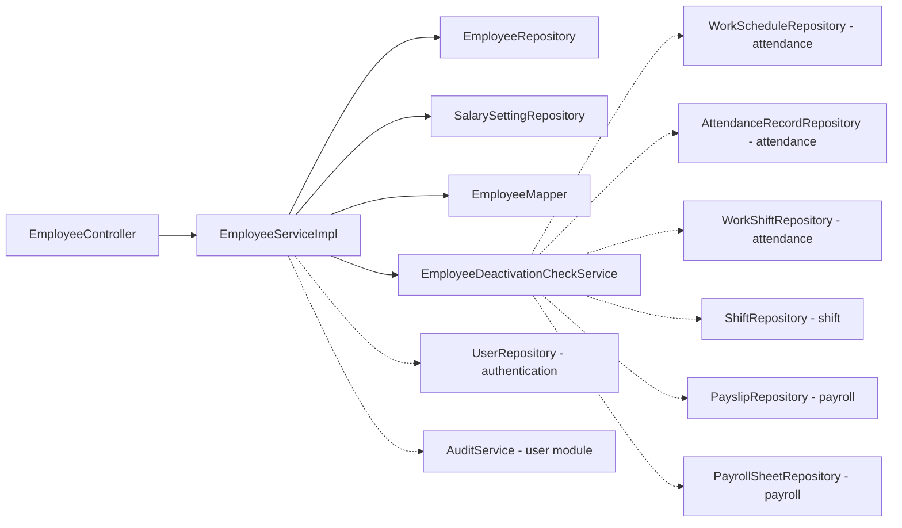
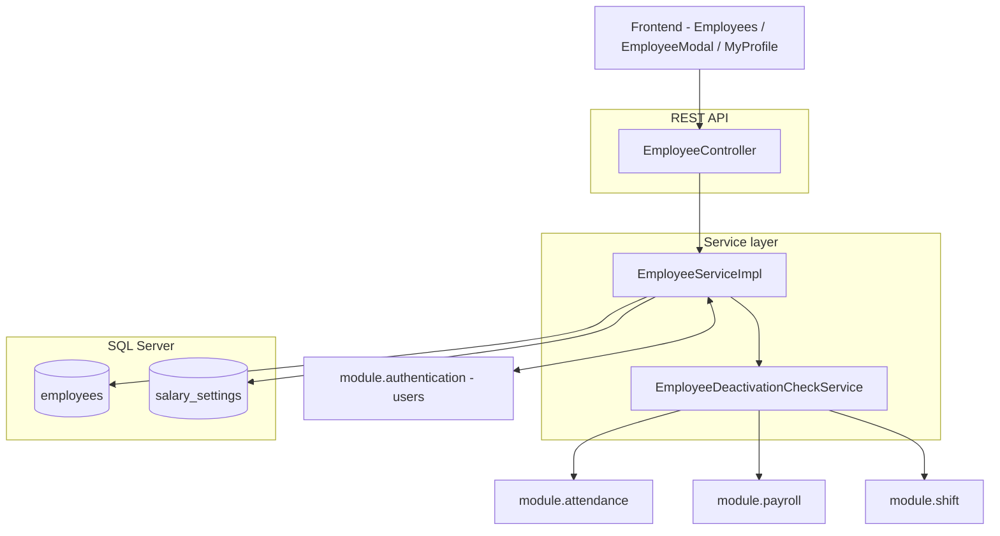
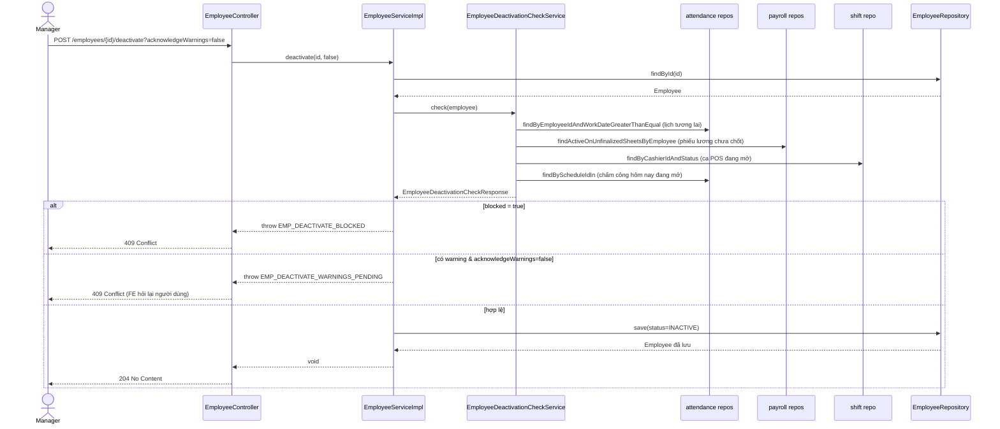
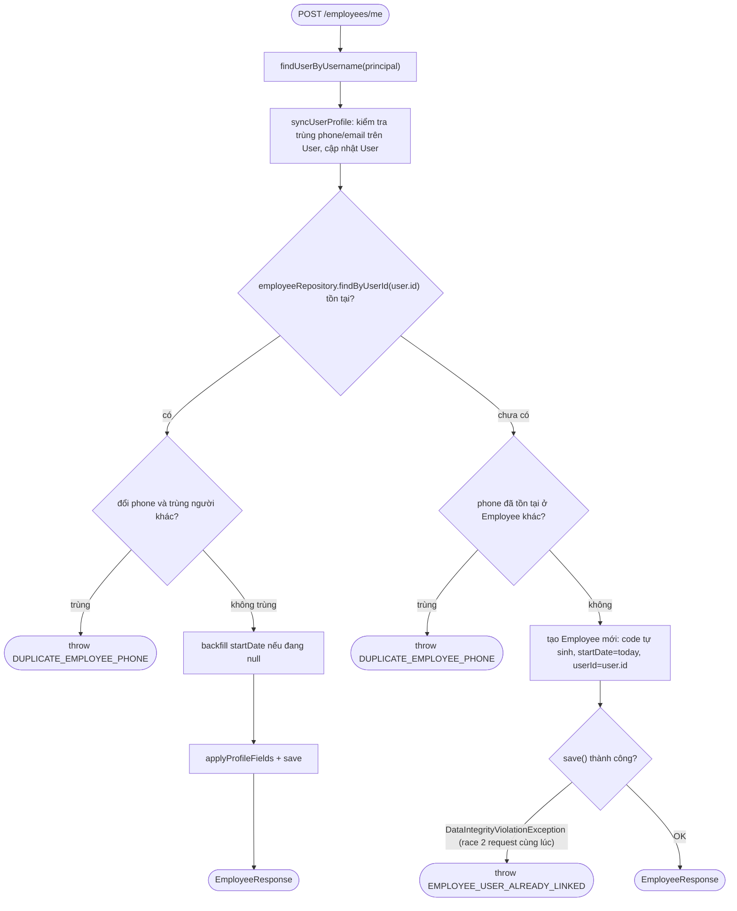

# Phân tích module Employee (`module/employee`)

> Phạm vi: toàn bộ `Backend/src/main/java/com/rms/restaurant/module/employee/**`, migration `V28__create_employees.sql`, enum dùng chung (`EmployeeStatus`, `SalaryType`), và các điểm tích hợp chéo module (`authentication`, `user`/audit, `attendance`, `payroll`, `shift`). Đọc trực tiếp từ source code hiện tại — mọi class/hàm nêu ra đều đã mở file xác nhận.

---

## 1. Mục đích của module

Employee (EMP) quản lý **hồ sơ nhân viên gốc** — tách biệt khỏi bảng `users` (tài khoản đăng nhập). Một `Employee` có thể **không** gắn tài khoản nào (0..1 liên kết `user_id`, filtered unique index vì SQL Server chỉ cho 1 NULL/UNIQUE thường). Module giải quyết:

1. **CRUD hồ sơ nhân viên** (mã, tên, SĐT, CCCD, ngày sinh, địa chỉ, avatar...) do Manager quản lý.
2. **Tự phục vụ ("Hồ sơ của tôi")**: nhân viên đăng nhập tự tạo/cập nhật hồ sơ của chính mình lần đầu (upsert), vì đường tạo hồ sơ thông thường (`POST /employees`) **bị khóa `denyAll` chủ đích** — tạo nhân viên trong hệ thống chỉ đi qua luồng self-service này.
3. **Ngừng hoạt động có kiểm tra chéo module** (`deactivate`): chặn cứng nếu còn lịch làm việc tương lai hoặc phiếu lương chưa chốt; cảnh báo mềm nếu còn ca thu ngân đang mở hoặc chấm công dở dang hôm nay.
4. **Thiết lập lương** (`SalarySetting`) — khai báo loại lương chính + OT cho từng nhân viên, làm input cho Payroll.
5. **Import/Export CSV hàng loạt** và **upload avatar**.

---

## 2. Kiến trúc module

Layered chuẩn (Controller → Service interface → Service impl → Repository → Entity), package phẳng, **không có sub-package `config`/`utils` riêng**. Có 1 thành phần phụ trợ đặc thù:

- **`EmployeeDeactivationCheckService`**: một `@Service` riêng (không implement interface `EmployeeService`), chuyên trách 1 việc — tổng hợp điều kiện được/không được ngừng hoạt động một nhân viên bằng cách **đọc trực tiếp repository của 3 module khác** (`attendance`, `payroll`, `shift`). Được `EmployeeServiceImpl` inject và gọi như một collaborator, không phải qua HTTP.

```
module/employee/
├── controller/   1 REST controller (EmployeeController)
├── service/      1 interface (EmployeeService)
│   └── impl/     2 impl class: EmployeeServiceImpl (chính) + EmployeeDeactivationCheckService (phụ trợ, đọc chéo module)
├── repository/   2 Spring Data JPA repository
├── model/        2 JPA entity (Employee, SalarySetting)
├── dto/          10 record/enum
└── mapper/       1 mapper thủ công (EmployeeMapper)
```

Mô hình dữ liệu:

```
employees (hồ sơ gốc, user_id 0..1 -> authentication.users)
     └─> salary_settings (1:1, tùy chọn)
```

`Employee` là entity **trung tâm** được nhiều module khác tham chiếu qua `employee_id`/`employeeId` (attendance, payroll, shift) — bản thân module employee không phụ thuộc ngược vào chúng, ngoại trừ `EmployeeDeactivationCheckService` (đọc, không ghi).

---

## 3. Danh sách class theo vai trò

### Controller (1)
`EmployeeController` — base path `/api/employees`, class-level `@PreAuthorize("hasAnyRole('MANAGER')")`; các endpoint tự phục vụ override method-level xuống `WAITER,CASHIER,MANAGER,ADMIN`.

### Service
| Interface | Impl | Trách nhiệm |
|---|---|---|
| `EmployeeService` | `EmployeeServiceImpl` | CRUD, self-service profile, deactivate, salary setting, import/export CSV |
| — (không có interface riêng) | `EmployeeDeactivationCheckService` | Tổng hợp điều kiện deactivate, đọc chéo 3 module khác |

### Repository (2)
`EmployeeRepository`, `SalarySettingRepository` — cả hai đều Spring Data JPA thuần (không JPQL phức tạp, trừ 2 method `search` có `@Query`).

### Entity (2)
`Employee` (bảng `employees`), `SalarySetting` (bảng `salary_settings`, 1:1 với employee qua `employeeId` unique).

### DTO (10)
Request: `CreateEmployeeRequest`, `UpdateEmployeeRequest`, `SelfEmployeeProfileRequest`, `SalarySettingRequest`.
Response: `EmployeeResponse`, `SalarySettingResponse`, `EmployeeDeactivationCheckResponse` (+ 4 record lồng bên trong), `EmployeeImportResultResponse` (+ `RowError` lồng bên trong), `UploadResponse`.
Enum: `ImportStrategy` (`STOP_ON_ERROR` / `SKIP_AND_CONTINUE`).
Enum dùng chung: `EmployeeStatus`, `SalaryType` (`common/utils/enums`).

### Mapper (1)
`EmployeeMapper` — 2 method thủ công: `toResponse(Employee)`, `toResponse(SalarySetting)` (overload theo tham số, không dùng MapStruct).

### Config / Utils
Không có config/utils riêng của module. Validate tuổi dùng `common/utils/validation/AgeValidator.validateEmployeeAge()` (dùng chung, không thuộc module employee).

---

## 4. Luồng xử lý theo từng use case

### UC-EMP-01/02 — Xem danh sách & chi tiết
`list()` phân trang + lọc theo code/name/phone/status qua 1 query JPQL động (`EmployeeRepository.search`, điều kiện `:param IS NULL OR ...`). `get(id)` lấy 1 bản ghi.

### UC-EMP-03 — Tạo hồ sơ (⚠ bị khóa qua API thường)
`POST /employees` tồn tại trong code (`EmployeeServiceImpl.create`) nhưng **controller chặn bằng `@PreAuthorize("denyAll")`** — quyết định nghiệp vụ cố ý, không phải bug. Đường tạo hồ sơ **thực tế duy nhất** là self-service (`saveMyProfile`, xem UC-EMP-06b).

### UC-EMP-04 — Cập nhật hồ sơ (Manager)
`update()`: partial-update (field `null`/blank thì giữ nguyên giá trị cũ, riêng field text thường dùng `StringUtils.hasText` để không ghi đè bằng chuỗi rỗng). Nếu đổi `phone` → kiểm tra trùng (`existsByPhoneAndIdNot`). Nếu đổi `userId` sang 1 user khác chưa liên kết → `linkUser()`. Sau khi lưu `Employee`, gọi `syncLinkedUser()` đẩy ngược `name/phone/email` sang `User` đã liên kết (nếu có) — **1 chiều Employee→User**, đối xứng với chiều User→Employee ở module authentication/user (không thuộc phạm vi phân tích này).

### UC-EMP-04b — Ngừng hoạt động nhân viên (có kiểm tra chéo module)
`deactivate(id, acknowledgeWarnings)`:
1. Gọi `EmployeeDeactivationCheckService.check(employee)` → trả `EmployeeDeactivationCheckResponse`.
2. Nếu `blocked=true` (còn lịch tương lai HOẶC còn phiếu lương chưa chốt) → ném `EMP_DEACTIVATE_BLOCKED`, **không có cách nào bỏ qua** (hard blocker).
3. Nếu có warning (`hasOpenPosShift` hoặc `hasOpenAttendanceToday`) mà `acknowledgeWarnings=false` → ném `EMP_DEACTIVATE_WARNINGS_PENDING` (soft warning, FE phải hỏi lại người dùng rồi gọi lại với `acknowledgeWarnings=true`).
4. Qua hết → set `status=INACTIVE`, lưu, ghi audit.

### UC-EMP-05/06 — Import / Export CSV
`exportCsv()`: xuất theo bộ lọc hoặc theo danh sách `ids` cụ thể, thêm BOM UTF-8 để Excel hiển thị tiếng Việt đúng.
`importCsv()`: đọc toàn file vào bộ nhớ trước (giới hạn 500 dòng — BR-IMP-02), validate từng dòng độc lập (tên, SĐT theo regex, status, trùng code/phone **trong cùng file** lẫn với DB), gom thành `toCreate`/`toUpdate`; nếu `strategy=STOP_ON_ERROR` và có bất kỳ lỗi nào → **không lưu gì cả**, trả lỗi ngay; nếu `SKIP_AND_CONTINUE` → lưu các dòng hợp lệ, bỏ qua dòng lỗi.

### UC-EMP-06b — Hồ sơ tự phục vụ ("Hồ sơ của tôi")
`saveMyProfile()` hoạt động như **upsert theo `userId` của người đăng nhập**:
- Đã có `Employee` gắn với user này → cập nhật tại chỗ (`applyProfileFields`), backfill `startDate = today` nếu trước đó chưa có, đồng thời `syncUserProfile()` đẩy name/phone/email ngược lại vào `User`.
- Chưa có → tạo mới `Employee` (`code` tự sinh, `startDate = today`, không lấy từ request), bắt race-condition 2 lần lưu đồng thời bằng `DataIntegrityViolationException` → dịch thành `EMPLOYEE_USER_ALREADY_LINKED` (guard thật sự là unique index `uq_employees_user_id`, không phải check `findByUserId` ở tầng service).

### UC-EMP-07 — Thiết lập lương
`getSalarySetting()`: nếu nhân viên chưa có `SalarySetting` → trả về 1 object mặc định **chưa lưu DB** (`id=null`) cho FE hiển thị form trống. `upsertSalarySetting()`: tìm theo `employeeId`, có thì update, chưa có thì tạo mới — JSON rate (`mainAdvancedRates`/`overtimeRates`) lưu thô, không chuẩn hóa (theo đúng note trong `SalarySetting`, phần tính toán chi tiết thuộc SRS_PAY).

### Upload avatar
Không có field riêng trong `EmployeeService` — controller nhận file, lưu qua `FileStorageService.storeImage()` (dùng chung, ngoài module), lấy URL rồi **gọi lại `employeeService.update()`** với 1 `UpdateEmployeeRequest` toàn `null` trừ `avatarUrl` — tái sử dụng đúng logic partial-update, không viết method riêng.

---

## 5. Chi tiết từng API

### `EmployeeController` (`/api/employees`)

| API | Controller | Service | Repository | Entity thay đổi | Transaction | Response |
|---|---|---|---|---|---|---|
| `GET` | `list` | `EmployeeService.list` | `EmployeeRepository.search(...,Pageable)` | — | readOnly | `PageResponse<EmployeeResponse>` |
| `GET /{id}` | `get` | `EmployeeService.get` | `EmployeeRepository.findById` | — | readOnly | `EmployeeResponse` |
| `GET /me` | `getMyProfile` | `EmployeeService.getMyProfile` | `UserRepository.findByUsername`, `EmployeeRepository.findByUserId` | — | readOnly | `EmployeeResponse` (rỗng nếu chưa có hồ sơ) |
| `POST /me` | `saveMyProfile` | `EmployeeService.saveMyProfile` | `UserRepository`, `EmployeeRepository.findByUserId`, `existsByPhoneAndIdNot`/`existsByPhone`, `.save` | **Update `User`** (name/phone/email) + **Insert/Update `Employee`** | read-write | `EmployeeResponse` |
| `POST` (denyAll) | `create` | `EmployeeService.create` | `existsByCode`, `existsByPhone`, `UserRepository.findById`, `existsByUserId`, `.save` | **Insert `Employee`** | read-write | *(không thể gọi qua HTTP — mọi role đều bị chặn)* |
| `PUT /{id}` | `update` | `EmployeeService.update` | `findById`, `existsByPhoneAndIdNot`, `.save`; + `UserRepository.findById/save` nếu sync | **Update `Employee`** (+ **Update `User`** nếu có liên kết) | read-write | `EmployeeResponse` |
| `POST /{id}/deactivate` | `deactivate` | `EmployeeService.deactivate` → `EmployeeDeactivationCheckService.check` | đọc chéo: `WorkScheduleRepository`, `PayslipRepository`, `ShiftRepository`, `AttendanceRecordRepository`, `WorkShiftRepository`, `PayrollSheetRepository`; ghi: `EmployeeRepository.save` | **Update `Employee.status=INACTIVE`** | read-write | `204 No Content` |
| `GET /{id}/deactivation-check` | `deactivationCheck` | `EmployeeService.checkDeactivationEligibility` → `EmployeeDeactivationCheckService.check` | như trên (chỉ đọc) | — | readOnly | `EmployeeDeactivationCheckResponse` |
| `GET /{id}/salary-setting` | `getSalarySetting` | `EmployeeService.getSalarySetting` | `findEmployeeById`, `SalarySettingRepository.findByEmployeeId` | — | readOnly | `SalarySettingResponse` |
| `PUT /{id}/salary-setting` | `upsertSalarySetting` | `EmployeeService.upsertSalarySetting` | `findEmployeeById`, `findByEmployeeId`, `.save` | **Insert/Update `SalarySetting`** | read-write | `SalarySettingResponse` |
| `GET /export` | `exportCsv` | `EmployeeService.exportCsv` | `findByIdIn` hoặc `search(...)` (không phân trang) | — | readOnly | `byte[]` CSV (Content-Disposition attachment) |
| `POST /import` | `importCsv` | `EmployeeService.importCsv` | `findAll()` (load hết để đối chiếu code/phone), `existsByPhone`/`existsByPhoneAndIdNot`, `.save` nhiều lần | **Insert/Update nhiều `Employee`** (hoặc không ghi gì nếu `STOP_ON_ERROR` gặp lỗi) | read-write | `EmployeeImportResultResponse` |
| `POST /{id}/avatar` | `uploadAvatar` | `FileStorageService.storeImage` rồi gọi lại `EmployeeService.update` | như `update()` | **Update `Employee.avatarUrl`** | read-write (qua update) | `UploadResponse` |

---

## 6. Business rule — implement ở đâu

| Rule | Ý nghĩa | Nơi implement |
|---|---|---|
| BR-EMP-01 | Mã nhân viên (nếu nhập tay) và SĐT phải duy nhất toàn hệ thống | `EmployeeServiceImpl.create`/`update` (`existsByCode`, `existsByPhone[AndIdNot]`) |
| BR-EMP-02 | 1 tài khoản `User` chỉ liên kết đúng 1 `Employee` tại một thời điểm | `EmployeeServiceImpl.linkUser` (`existsByUserId`) + filtered unique index `uq_employees_user_id` (V28) làm lưới an toàn cuối |
| BR-EMP-03 | Sửa tên/SĐT/email của nhân viên có liên kết tài khoản → đồng bộ ngược sang `User` | `EmployeeServiceImpl.syncLinkedUser` |
| BR-EMP-04 (SRS §9 gap #2) | Ngừng hoạt động: chặn cứng nếu còn lịch tương lai/phiếu lương chưa chốt; cảnh báo mềm nếu còn ca POS mở/chấm công dở dang, phải "acknowledge" mới cho qua | `EmployeeServiceImpl.deactivate`, `EmployeeDeactivationCheckService.check` |
| BR-EMP-05 | Mẫu lương áp dụng kiểu copy-on-apply, sửa/xóa mẫu sau không hồi tố | `EmployeeServiceImpl.upsertSalarySetting` (lưu giá trị thô vào `SalarySetting`, không giữ tham chiếu tới mẫu) |
| BR-EMP-06 | "Hồ sơ của tôi" là upsert theo user đăng nhập; code/status/timekeepCode/avatar/userId không tự sửa qua luồng này | `EmployeeServiceImpl.saveMyProfile`, `applyProfileFields` |
| BR-IMP-02 | Import CSV tối đa 500 dòng, vượt thì từ chối cả file trước khi xử lý dòng nào | `EmployeeServiceImpl.importCsv` (`MAX_IMPORT_ROWS`) |
| BR-IMP-03 | Bắt buộc chọn `ImportStrategy` trước khi import, không có mặc định ngầm | `EmployeeController.importCsv` (`@RequestParam` bắt buộc), `dto/ImportStrategy` |
| Tuổi hợp lệ | Nhân viên phải trong khoảng tuổi cho phép (18–60) | `AgeValidator.validateEmployeeAge` (dùng chung), gọi từ `create`/`update`/`saveMyProfile` |
| Tạo nhân viên bị khóa | `POST /employees` tồn tại nhưng luôn từ chối mọi role | `EmployeeController.create` — `@PreAuthorize("denyAll")` |

---

## 7. Dependency giữa các class (nội bộ module)



Ghi chú: `EmployeeDeactivationCheckService` không nằm chung interface với `EmployeeService` — nó là 1 collaborator độc lập, injected trực tiếp bằng field `deactivationCheckService` trong `EmployeeServiceImpl`. Toàn bộ đường nét đứt trong sơ đồ là **phụ thuộc ra ngoài module** (mục 8).

---

## 8. Gọi sang module khác

| Module đích | Class gọi | Mục đích |
|---|---|---|
| `module.authentication` (`User`, `UserRepository`) | `EmployeeServiceImpl` (`linkUser`, `syncLinkedUser`, `syncUserProfile`, `findUserByUsername`, `getMyProfile`, `saveMyProfile`) | Gắn/tra cứu tài khoản đăng nhập ứng với hồ sơ nhân viên; đồng bộ 2 chiều tên/SĐT/email khi 1 trong 2 phía được sửa |
| `module.user` (`AuditService`) | `EmployeeServiceImpl.audit()` | Ghi audit log cho mọi thao tác tạo/sửa/deactivate/self-service/salary-setting (nuốt lỗi nếu audit fail, không chặn nghiệp vụ chính) |
| `module.attendance` (`WorkScheduleRepository`, `AttendanceRecordRepository`, `WorkShiftRepository`) | `EmployeeDeactivationCheckService.check` | Tìm lịch làm việc **tương lai** (hard blocker) và chấm công **đang mở** hôm nay (soft warning) trước khi cho ngừng hoạt động |
| `module.payroll` (`PayslipRepository`, `PayrollSheetRepository`) | `EmployeeDeactivationCheckService.check` | Tìm phiếu lương thuộc bảng lương **chưa chốt (unfinalized)** của nhân viên (hard blocker) |
| `module.shift` (`ShiftRepository`, `Shift`) | `EmployeeDeactivationCheckService.check` | Tìm ca thu ngân (cash-drawer shift) đang **mở** của nhân viên (soft warning) — dùng `Shift.status` dạng free-text `"OPEN"`, không phải enum |

**Chiều ngược lại** (module khác gọi vào Employee) rất phổ biến nhưng không thuộc phạm vi file này — `attendance`, `payroll`, `shift` đều đọc trực tiếp `EmployeeRepository`/`Employee` (tra cứu tên/mã, check `status=ACTIVE`) vì `Employee` là bảng tham chiếu trung tâm.

---

## 9. Điểm cần chú ý khi sửa code

1. **`POST /employees` không chết, chỉ bị khóa quyền.** `EmployeeServiceImpl.create()` vẫn là code sống (có thể có test gọi thẳng service). Đừng nhầm "denyAll" là dấu hiệu code đã lỗi thời — đây là quyết định nghiệp vụ cố ý (comment ngay trong controller). Nếu sau này cần mở lại đường tạo thủ công cho Manager, chỉ cần đổi `@PreAuthorize`, logic service đã sẵn sàng.
2. **`syncLinkedUser`/`syncUserProfile` là 2 hướng đồng bộ riêng biệt, không dùng chung code**: `syncLinkedUser` (Employee→User, dùng khi Manager sửa từ màn Employee) và `syncUserProfile` (dùng trong self-service, User được sửa cùng lúc). Sửa logic đồng bộ ở module User (đối xứng chiều ngược lại) **phải soát cả 2 chỗ này** để 2 bảng không trôi lệch nhau.
3. **Guard chống trùng liên kết `userId` có 2 lớp, không chỉ 1**: check `existsByUserId` ở tầng service (`linkUser`) **race-condition được**, lớp an toàn thật sự là unique index DB (`uq_employees_user_id`) bắt qua `DataIntegrityViolationException` trong `saveMyProfile`. Nếu thêm đường tạo `Employee` mới nào khác, phải bọc try/catch tương tự, đừng chỉ tin check `existsByUserId`.
4. **`deactivate()` có 2 loại điều kiện khác hẳn nhau về mặt UX**: `blocked` không có cách bỏ qua (phải giải quyết ở module khác trước); warning thì cần `acknowledgeWarnings=true` gọi lại. Sửa thêm điều kiện mới cần xác định rõ nó thuộc loại nào — thêm nhầm vào "blocked" sẽ khóa cứng use case hợp lệ.
5. **`checkDeactivationEligibility` (GET) và `deactivate` (POST) gọi cùng 1 `EmployeeDeactivationCheckService.check()`** — không có cache giữa 2 lần gọi, dữ liệu có thể đã đổi giữa lúc FE hiển thị cảnh báo và lúc người dùng bấm xác nhận (ví dụ nhân viên vừa được xếp thêm lịch mới). Đây là race window đã biết, chấp nhận được vì thao tác này hiếm và có người thao tác trực tiếp.
6. **`importCsv` nạp toàn bộ `employeeRepository.findAll()` vào bộ nhớ** để đối chiếu code/phone — chấp nhận được với quy mô nhà hàng nhỏ nhưng sẽ không scale nếu số nhân viên tăng lớn; nếu tối ưu, cần giữ đúng ngữ nghĩa "trùng trong cùng file" (`codesInBatch`/`phonesInBatch`) chứ không chỉ so với DB.
7. **`EmployeeMapper` không dùng MapStruct** — thêm field mới vào `Employee`/`EmployeeResponse` phải tự sửa tay `toResponse()`, dễ quên (giống pattern ở module attendance).
8. **`EmployeeDeactivationCheckService` phụ thuộc trực tiếp vào tên method repository của 3 module khác** (`findByEmployeeIdAndWorkDateGreaterThanEqualOrderByWorkDateAsc`, `findActiveOnUnfinalizedSheetsByEmployee`, `findByCashierIdAndStatus`...). Đổi tên/xóa các method này ở `attendance`/`payroll`/`shift` sẽ làm gãy compile ở module employee — đây là điểm coupling chéo module cần rà khi refactor các module kia.
9. **Tài liệu `business-rules-management-modules.md` (mục BR-EMP-04b) đang mô tả hành vi cũ** ("deactivate không kiểm tra ca đang mở") — thực tế code hiện tại (2026-07-27, SRS §9 gap #2) **đã có** kiểm tra ca POS mở + chấm công dở dang như warning. Nếu đọc lại tài liệu đó để hiểu behavior, ưu tiên đọc code/`EmployeeDeactivationCheckService` thay vì tin nguyên văn dòng BR-EMP-04b.
10. **Import/Export CSV và upload avatar hiện chưa có UI tiêu thụ ở `Frontend/ManagementWebsite`** (đã grep xác nhận không có lời gọi `/employees/import`, `/employees/export`, `/employees/{id}/avatar` từ frontend) — 3 API này chỉ dùng được qua gọi trực tiếp (Postman/script) cho tới khi có UI.

---

## 10. Sơ đồ luồng xử lý (Mermaid)

### 10.1. Kiến trúc & luồng dữ liệu tổng quan



### 10.2. Sequence diagram — Ngừng hoạt động nhân viên (UC-EMP-04b, `POST /api/employees/{id}/deactivate`)



### 10.3. Flowchart — Hồ sơ tự phục vụ ("Hồ sơ của tôi", upsert theo user đăng nhập)


